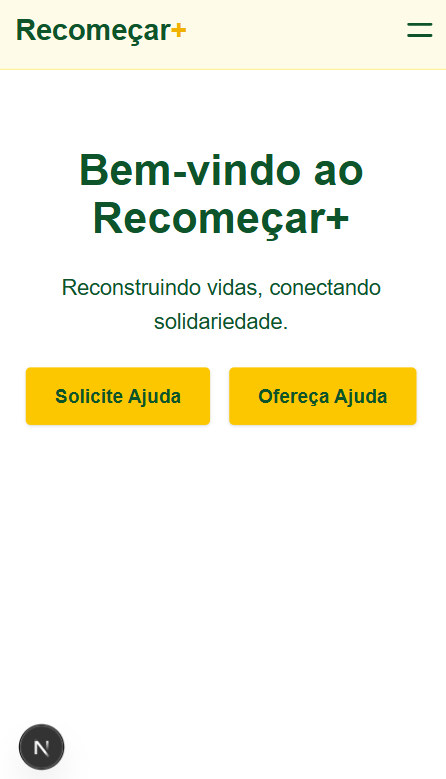
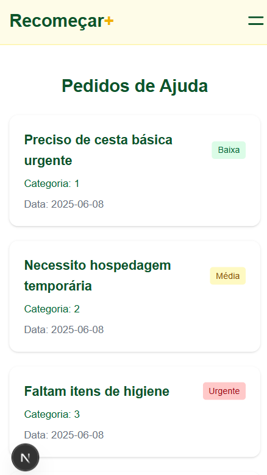
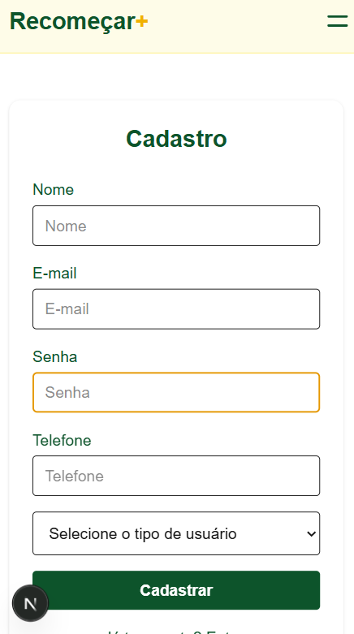

# Recomeçar+ (Frontend)

Reconstruindo vidas, conectando solidariedade.

---

## Visão Geral

O **Recomeçar+** é uma plataforma web responsiva desenvolvida em **React/Next.js** que conecta vítimas de desastres a voluntários, promovendo ajuda rápida, transparente e organizada.

> Este repositório é **apenas o frontend** (SPA) — para o backend, consulte o repositório específico da API.

---

## Link do Projeto na Vercel

> https://recomecar-l7dv.vercel.app/

## Link da API

> https://recomecar-restfulapi.onrender.com/

## Video da solução:

> https://www.loom.com/share/9cae77315f314055ac8c0796f0ba63c5

## Prints das principais telas

- 
- 
- 

---

## Principais Funcionalidades

- Login, cadastro e autenticação via localStorage
- Cadastro de pedidos de ajuda (por vítimas)
- Cadastro de ofertas de ajuda (por voluntários)
- Histórico de solicitações e contribuições do usuário
- Visualização de pedidos, detalhes e match com voluntário
- Menu responsivo com navegação dinâmica
- Feedback visual (loading, erros, sucesso)
- Totalmente responsivo (mobile first)
- Acessibilidade: campos com label, contraste adequado
- Logout seguro
- **Consumo 100% via REST API** (endpoints em `.env`)

---

## Organização do Projeto

```
/app
  /components      # Componentes reutilizáveis (Campo, Select, Header, etc)
  /pages           # Páginas (rotas) estruturadas por funcionalidade
  /types           # Tipos e interfaces TypeScript compartilhados
.env.local         # Variáveis de ambiente (ex: API_URL)
README.md
```

### Principais Componentes (`/app/components`)

- `Campo.tsx` — Campo de formulário genérico com label e acessibilidade
- `Select.tsx` — Select customizado padronizado
- `Botao.tsx` — Botão estilizado, suporta loading
- `Header.tsx` — Menu responsivo com hamburger no mobile
- `Feedback.tsx` — Mensagens de loading, erro ou vazio
- `PedidoCard.tsx` — Card para exibição de pedidos no mobile

### Tipos Globais (`/app/types`)

- `usuario.ts` — Interface do usuário logado
- `pedido-ajuda.ts` — Pedido de ajuda (campos, status, datas)
- `oferta-ajuda.ts` — Oferta de ajuda cadastrada por voluntários
- `categoria.ts` — Tipos de categoria do sistema (ex: alimentos, abrigo)
- `status-pedido.ts` — Status de um pedido (pendente, aprovado, etc)
- `historico-tabela-props.ts` — Tipagem das props dos componentes de histórico

---

## Como Rodar o Projeto

### 1. Clone o repositório

```bash
git clone https://github.com/Gabriel-Souza10/Recome-ar
cd recomecar-frontend
```

### 2. Instale as dependências

```bash
npm install
```

### 3. Configure as variáveis de ambiente

Crie um arquivo `.env` na raiz:

```
NEXT_PUBLIC_API_URL=http://localhost:8080
```

> Altere a URL para o endpoint real do seu backend se necessário.

### 4. Rode o projeto em modo desenvolvimento

```bash
npm run dev
```

Acesse [http://localhost:3000](http://localhost:3000) no navegador.

---

## Build & Deploy

- Para build de produção: `npm run build`
- Para rodar o build localmente: `npm start`
- Para deploy: recomendado [Vercel](https://vercel.com) (Next.js ready!)

> **OBS:** Não coloque endpoints hardcoded, sempre use `process.env.NEXT_PUBLIC_API_URL` para as URLs da API.

---

## Tecnologias Utilizadas

- **Next.js 15.3.3+** (App Router)
- **TypeScript**
- **Tailwind CSS** (responsividade)
- **Fetch API**
- **Vercel** (deploy)

---

## Equipe

- **Bruno Tizer** (RM: 559999)
- **Gabriel Dos Santos Souza** (RM: 560812)
- **Thomas Henrique Baute** (RM: 560649)
